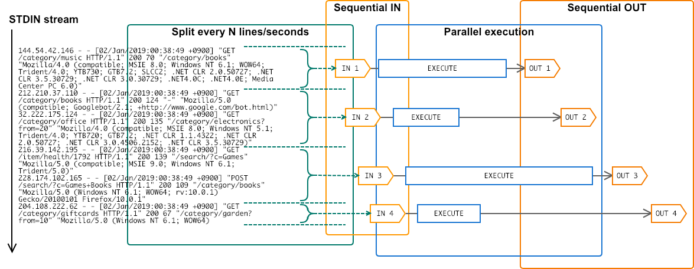

# evry

`evry` split STDIN stream and execute specified command **every** N lines/seconds.

Key features of `evry` are:

- Split STDIN stream **every N lines** or **every N seconds**.
- **Sequential** IN -> **Parallel execution** -> **Sequential OUT**.



## Usage

``` console
$ [STDIN] | evry [-l N or -s N] -c [COMMAND]
```

### Count number of requests every 10 seconds

``` console
$ tail -f access.log | evry -s 10 -c 'wc -l'
```

### Show top 5 access rank every 1000 lines

``` console
$ tail -f access.log | evry -l 1000 -c 'cut -d" " -f7 | sort | uniq -c | sort -nr | head -5'
```

## Installation

```console
$ go get github.com/k1LoW/evry
```

## References

- https://github.com/mattn/go-pipeline
