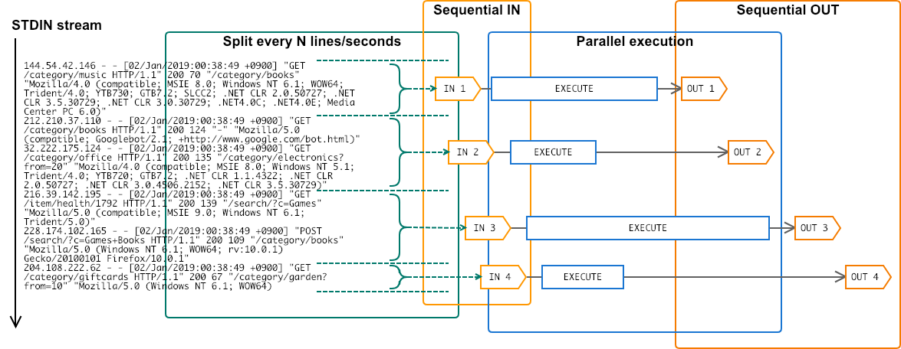

# evry [](https://github.com/k1LoW/evry/actions) [](https://github.com/k1LoW/evry/releases)

`evry` split STDIN stream and execute specified command **every** N lines/seconds.


Key features of `evry` are:

- Split STDIN stream **every N lines** or **every N seconds**.
- **Sequential** IN -> **Parallel execution** -> **Sequential OUT**.



## Usage

``` console
$ [STDIN] | evry [-l N or -s N] -c [COMMAND]
```

or

``` console
$ [STDIN] | evry [-l N or -s N] -- [COMMAND]
```

### Count number of requests every 10 seconds

``` console
$ tail -F access.log | evry -s 10 -- wc -l
```

### Show top 5 access rank every 1000 lines

``` console
$ tail -F access.log | evry -l 1000 -c 'cut -d" " -f7 | sort | uniq -c | sort -nr | head -5'
```

## Install

**deb:**

Use [dpkg-i-from-url](https://github.com/k1LoW/dpkg-i-from-url)

``` console
$ export EVRY_VERSION=X.X.X
$ curl -L https://git.io/dpkg-i-from-url | bash -s -- https://github.com/k1LoW/evry/releases/download/v$EVRY_VERSION/evry_$EVRY_VERSION-1_amd64.deb
```

**RPM:**

``` console
$ export EVRY_VERSION=X.X.X
$ yum install https://github.com/k1LoW/evry/releases/download/v$EVRY_VERSION/evry_$EVRY_VERSION-1_amd64.rpm
```

**apk:**

Use [apk-add-from-url](https://github.com/k1LoW/apk-add-from-url)

``` console
$ export EVRY_VERSION=X.X.X
$ curl -L https://git.io/apk-add-from-url | sh -s -- https://github.com/k1LoW/evry/releases/download/v$EVRY_VERSION/evry_$EVRY_VERSION-1_amd64.apk
```

**homebrew tap:**

```console
$ brew install k1LoW/tap/evry
```

**manually:**

Download binary from [releases page](https://github.com/k1LoW/evry/releases)

**go get:**

```console
$ go get github.com/k1LoW/evry
```

**docker:**

```console
$ docker pull ghcr.io/k1low/evry:latest
```

## References

- https://github.com/mattn/go-pipeline
